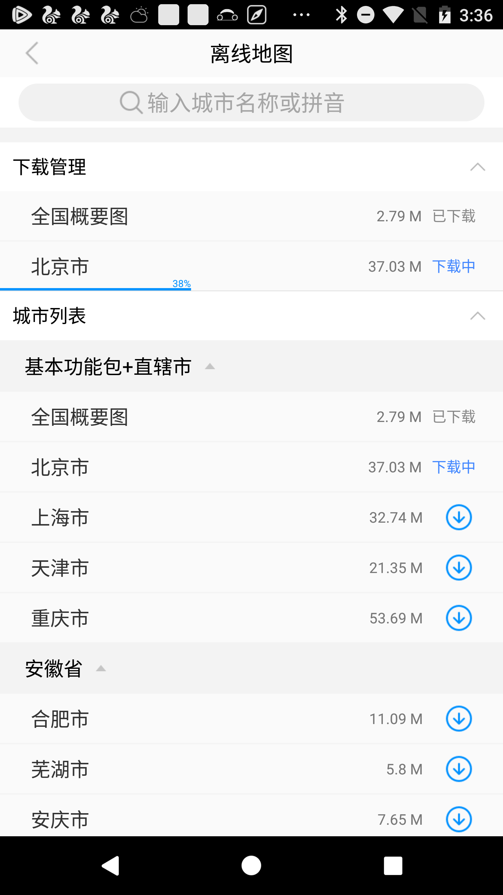

# 高德地图 使用离线地图

高德3D 地图 SDK支持离线地图功能。（2D 地图 SDK 不支持离线地图功能）

离线地图可满足在无网络环境下查看地图信息的需求，在设备本地有离线地图数据的情况下，SDK 会优先加载离线地图。

## 离线地图UI组件（推荐）

自3D地图SDK v 5.7.0起，新增离线地图UI组件，组件涵盖城市下载、暂停、更新、删除以及关键字城市查询等功能，是高德地图客户端离线地图功能的一个子集，UI交互风格上靠拢高德地图app，也考虑到与开发者应用UI的融合问题，尽可能的保持了简约极致。以下方法实现一键完成离线地图开发。

#### 增加权限

[Java]()

```
权限包涵网络和SD卡读写权限 
<uses-permission android:name="android.permission.INTERNET" /> 
<uses-permission android:name="android.permission.WRITE_EXTERNAL_STORAGE" /> 
<uses-permission android:name="android.permission.ACCESS_NETWORK_STATE" />
```

#### 注册Activity

*Activity*在SDK内部实现，仅需要在工程 AndroidManifest.xml 中配置 *com.amap.api.maps.offlinemap.OfflineMapActivity* 即可

[Java]()

```
<activity android:name="com.amap.api.maps.offlinemap.OfflineMapActivity"
              android:screenOrientation="portrait"  />
```

#### 启动离线地图组件

[Java]()

```
//在Activity页面调用startActvity启动离线地图组件
startActivity(new Intent(this.getApplicationContext(),
                    com.amap.api.maps.offlinemap.OfflineMapActivity.class));
```

#### UI示意




## 自定义离线地图UI

#### 开始下载

可以根据城市编码和城市名称两种方式下载当前城市的离线地图。示例代码如下：

[Java]()

```
//构造OfflineMapManager对象 
OfflineMapManager amapManager = new OfflineMapManager(this, this);
//按照citycode下载
amapManager.downloadByCityCode(String citycode)；
//按照cityname下载
amapManager.downloadByCityName(String cityname)；
```

###  

#### 暂停下载

通过代码暂停地图的下载:

示例代码如下：

[Java]()

```
amapManager.pause();
```

####  停止下载

停止所有当前正在执行的下载，包括下载队列中等待的部分。

示例代码如下：

[Java]()

```
amapManager.stop();
```

###  

#### 更改离线地图存储目录

离线地图默认会下载到手机存储卡的“amap”目录下，也可以自定义路径：

通过 MapInitializer.sdcardDir 设置路径时，需要在 AMap 对象初始化之前进行，否则操作会无效。 

[Java]()

```
// 设置应用单独的地图存储目录
MapsInitializer.sdcardDir = "自定义的目录";
```

###  

#### 获取离线地图列表

其属性参数见下表：

| 名称                       | 说明                                              |
| -------------------------- | ------------------------------------------------- |
| 获取城市列表               | OfflineMapManager.getOfflineMapCityList()         |
| 获取省列表                 | OfflineMapManager.getOfflineMapProvinceList()     |
| 获取已下载城市列表         | OfflineMapManager.getDownloadOfflineMapCityList() |
| 获取正在或等待下载城市列表 | OfflineMapManager.getDownloadingCityList()        |

## 检查更新

通过如下代码检查离线地图数据是否存在更新，检查更新操作会同时将本地离线地图配置文件更新成最新的，App 用户可依据最新的配置文件下载新版离线地图数据。

示例代码如下：

[Java]()

```
//通过updateOfflineCityByName方法判断离线地图数据是否存在更新
amapManager.updateOfflineCityByName(city);
```

## 删除离线地图

执行 remove 操作时，需要等待 OfflineLoadedListener 回调之后才可以，否则（即使OfflineMapDownloadListener回调成功）操作将会无效。 

示例代码如下：

[Java]()

```
//删除某一城市的离线地图包
amapManager.remove(city);
```

来源： https://lbs.amap.com/api/android-sdk/guide/create-map/offline-map