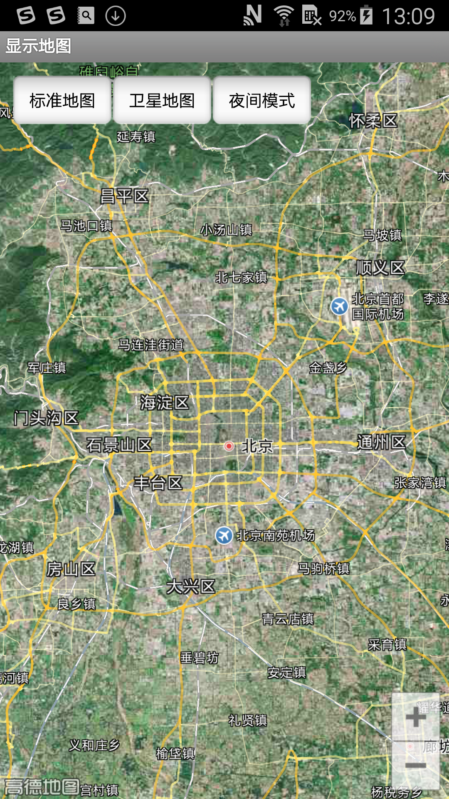
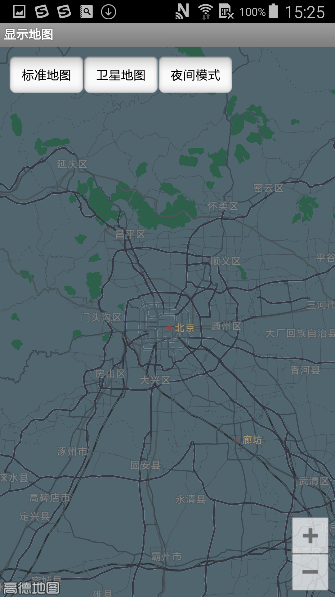
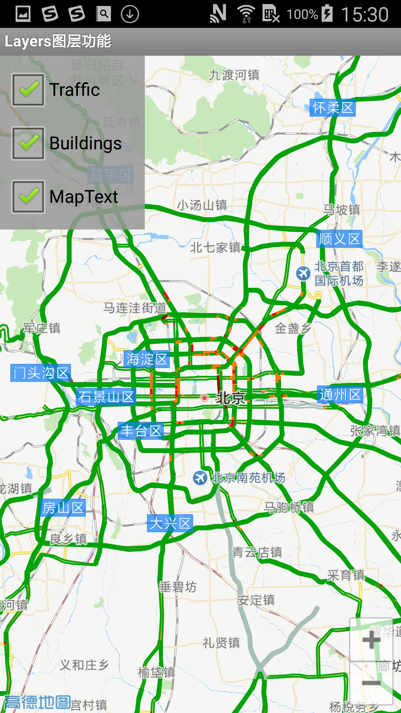

# 高德地图 - 显示图层

Android 地图 SDK 提供了几种预置的地图图层，包括卫星图、白昼地图（即最常见的黄白色地图）、夜景地图、导航地图、路况图层。

AMap 类提供图层类型常量，详细如下：

注意：路况图层是通过开关控制，不通过常量控制。

| 名称               | 说明                   |
| ------------------ | ---------------------- |
| MAP_TYPE_NAVI      | 导航地图               |
| MAP_TYPE_NIGHT     | 夜景地图               |
| MAP_TYPE_NORMAL    | 白昼地图（即普通地图） |
| MAP_TYPE_SATELLITE | 卫星图                 |

下文就卫星图、夜景地图和路况图做简单介绍。

## 卫星地图

卫星地图在显示卫片（卫星照片）的同时也可以显示路网信息，设置卫星地图的代码及显示效果如下：

[Java]()

```
aMap.setMapType(AMap.MAP_TYPE_SATELLITE);// 设置卫星地图模式，aMap是地图控制器对象。
```

显示效果如下：



## 夜景地图

设置夜景地图的代码如下：

[Java]()

```
aMap.setMapType(AMap.MAP_TYPE_NIGHT);//夜景地图，aMap是地图控制器对象。
```

显示效果如下：



## 路况图层

路况图依据实时路况数据渲染，与前两种设置方式不太相同，路况图实现的方法如下：

[Java]()

```
aMap.setTrafficEnabled(true);//显示实时路况图层，aMap是地图控制器对象。
```

显示效果如下：



来源： https://lbs.amap.com/api/android-sdk/guide/create-map/set-maptype