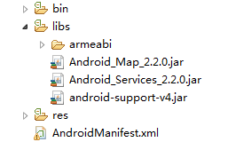
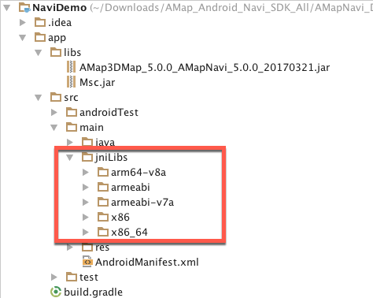
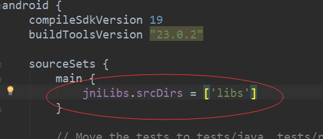
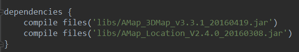
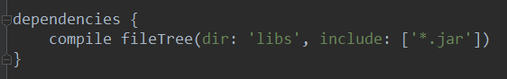
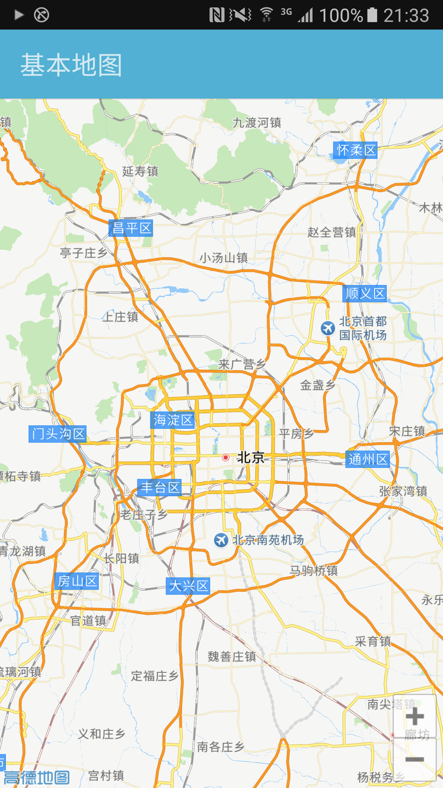

# 高德地图 - 显示地图

使用地图SDK之前，需要在 AndroidManifest.xml 文件中进行相关权限设置，确保地图功能可以正常使用。

### 第一步，配置AndroidManifest.xml

#### **首先，声明权限**

[XML]()

```
//地图SDK（包含其搜索功能）需要的基础权限
     
<!--允许程序打开网络套接字-->
<uses-permission android:name="android.permission.INTERNET" />
<!--允许程序设置内置sd卡的写权限-->
<uses-permission android:name="android.permission.WRITE_EXTERNAL_STORAGE" />   
<!--允许程序获取网络状态-->
<uses-permission android:name="android.permission.ACCESS_NETWORK_STATE" /> 
<!--允许程序访问WiFi网络信息-->
<uses-permission android:name="android.permission.ACCESS_WIFI_STATE" /> 
<!--允许程序读写手机状态和身份-->
<uses-permission android:name="android.permission.READ_PHONE_STATE" />     
<!--允许程序访问CellID或WiFi热点来获取粗略的位置-->
<uses-permission android:name="android.permission.ACCESS_COARSE_LOCATION" /> 
```

#### **然后，设置高德Key**

在application标签中加入如下内容：

[XML]()

```
<meta-data android:name="com.amap.api.v2.apikey" android:value="key">
//开发者申请的key  
</meta-data>
```

[点我获取Key](https://lbs.amap.com/dev/#/)。

[点我查看Key注册时必要数据SHA1和包名的获取方法](https://lbs.amap.com/faq/top/hot-questions/249)。

### 第二步，向工程中添加地图开发包

向一个Android应用中添加地图，具体步骤如下：

#### 在Eclipse环境下：

**步骤1：**开发工程中新建“ libs ”文件夹，将地图包（2D或3D）、搜索包拷贝到 libs 的根目录下。若选择3D地图包，还需要将各库文件夹一起拷贝。拷贝完成后的工程目录(以3D V2.2.0为例)如图所示：



####  在Android Studio环境下：

**步骤1：**

添加so文件，在src/main/目录下新建jniLibs目录，并将文件放入其中。

**方法一：**

使用默认配置，不需要修改build.gradle。在 main 目录下创建文件夹 jniLibs (如果有就不需要创建了)，将下载文件的 armeabi 文件夹复制到这个目录下,如果已经有这个目录，将下载的 so 库复制到这个目录即可。如图所示：



**方法二：**

使用自定义配置，将下载文件的 armeabi 文件夹复制到 libs 目录，如果有这个目录,请将下载的 so 库复制到这个目录，然后打开build.gradle，找到 asourceSets 标签，在里面增加一项配置，如图所示：



#####  

**步骤2：**

将jar包放入libs目录下。对于每个jar文件，右键-选择Add As Library，导入到工程中。或者使用菜单栏 选择 File ->Project Structure->Modules-> Dependencies。点击绿色的加号选择File dependency. 然后选择要添加的jar包即可，此时build.gradle中会自动生成如下信息。



或者直接使用引入libs下所有jar包的方式，如下图所示：



## 第三步，初始化地图容器

MapView 是 AndroidView 类的一个子类， 用于在 Android View 中放置地图。 MapView 是地图容器。用 MapView 加载地图的方法与 Android 提供的其他 View 一样，具体的使用步骤如下：

首先在布局xml文件中添加地图控件:

[XML]()

```
<com.amap.api.maps.MapView

    android:id="@+id/map"

    android:layout_width="match_parent"

    android:layout_height="match_parent"/>
```

在项目中使用地图的时候需要注意，需要合理的管理地图生命周期，这非常的重要。

以下示例简述地图生命周期的管理：

[Java]()

```
public class MainActivity extends Activity {
  MapView mMapView = null;
  @Override
  protected void onCreate(Bundle savedInstanceState) {
    super.onCreate(savedInstanceState); 
    setContentView(R.layout.activity_main);
    //获取地图控件引用
    mMapView = (MapView) findViewById(R.id.map);
    //在activity执行onCreate时执行mMapView.onCreate(savedInstanceState)，创建地图
    mMapView.onCreate(savedInstanceState);
  }
  @Override
  protected void onDestroy() {
    super.onDestroy();
    //在activity执行onDestroy时执行mMapView.onDestroy()，销毁地图
    mMapView.onDestroy();
  }
 @Override
 protected void onResume() {
    super.onResume();
    //在activity执行onResume时执行mMapView.onResume ()，重新绘制加载地图
    mMapView.onResume();
    }
 @Override
 protected void onPause() {
    super.onPause();
    //在activity执行onPause时执行mMapView.onPause ()，暂停地图的绘制
    mMapView.onPause();
    }
 @Override
 protected void onSaveInstanceState(Bundle outState) {
    super.onSaveInstanceState(outState);
    //在activity执行onSaveInstanceState时执行mMapView.onSaveInstanceState (outState)，保存地图当前的状态
    mMapView.onSaveInstanceState(outState);
  } 
}
```

## 常用地图容器

地图 SDK 底层运用两种 OpenGL ES 组件构建地图，分别是 GLSurfaceView 和 TextureView，如果您对本节内容不感兴趣，可直接略过此节阅读第四步。

#### GLSurfaceView：

包括 MapView、MapFragment、SupportMapFragment 三种容器。下面简单介绍一下 **SupportMapFragment：**

MapFragment 是 Android Fragment 类的一个子类，用于在 Android Fragment 中放置地图。 MapFragment 也是地图容器，与 MapView 一样提供对 AMap 对象（地图的控制类）的访问权。与 MapView 相比 SupportMapFragment 方便之处在于其可以更好的管理地图的生命周期，布局灵活。

#### TextureView：

包括TextureMapView、TextureMapFragment、TextureSupportMapFragment 三种容器。

使用场景：您将MapView与其他的GLSurfaceView（比如相机）叠加展示，或者是在ScrollView中加载地图时，建议使用TextureMapView及SupportTextureMapFragment来展示地图，可以有效解决 GLSurfaceView 叠加时出现的穿透、滚动黑屏等问题。篇幅有限，如果您感兴趣的话，以上6种地图容器的构造均可在[官方示例代码](https://lbs.amap.com/api/android-sdk/download/)中找到具体的使用方法。

## 第四步，显示地图

AMap 类是地图的控制器类，用来操作地图。它所承载的工作包括：地图图层切换（如卫星图、黑夜地图）、改变地图状态（地图旋转角度、俯仰角、中心点坐标和缩放级别）、添加点标记（Marker）、绘制几何图形(Polyline、Polygon、Circle)、各类事件监听(点击、手势等)等，AMap 是地图 SDK 最重要的核心类，诸多操作都依赖它完成。

在 MapView 对象初始化完毕之后，构造 AMap 对象。示例代码如下：

[Java]()

```
//定义了一个地图view
mapView = (MapView) findViewById(R.id.map);
mapView.onCreate(savedInstanceState);// 此方法须覆写，虚拟机需要在很多情况下保存地图绘制的当前状态。
//初始化地图控制器对象
AMap aMap;
if (aMap == null) {
    aMap = mapView.getMap();        
}
```

篇幅有限，如果您感兴趣的话，以上6种地图容器初始化 AMap 对象的方式均可在[官方示例代码](https://lbs.amap.com/api/android-sdk/download/)中找到具体的示例。

运行您刚完成的工程就可以在您的 APP 中看到高德地图了。运行后的效果如下图所示：



来源： https://lbs.amap.com/api/android-sdk/guide/create-map/show-map