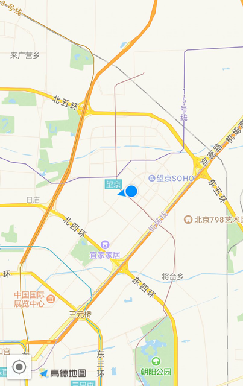

# 高德地图 - 显示定位蓝点

定位蓝点指的是进入地图后显示当前位置点的功能。自Android 3D地图 SDK 5.0.0版本之后定位蓝点实现无需依赖 [Android 定位 SDK](https://lbs.amap.com/api/android-location-sdk/guide/android-location/getlocation) ，5.0.0 版本之前需要引入地图 SDK 和定位 SDK 到工程中。效果如下：

效果如下：

[](https://a.amap.com/lbs/static/img/android_location_marker.png)


https://a.amap.com/lbs/static/img/android_location_marker.png)

## 实现定位蓝点（5.0.0版本后）

#### 第一步，初始化 AMap 对象

初始化 AMap 对象内容在[显示地图](https://lbs.amap.com/api/android-sdk/guide/create-map/show-map/)章节中有详细讲解。

#### 第二步，实现定位蓝点

实现定位蓝点：

[Java]()

```
MyLocationStyle myLocationStyle;
myLocationStyle = new MyLocationStyle();//初始化定位蓝点样式类myLocationStyle.myLocationType(MyLocationStyle.LOCATION_TYPE_LOCATION_ROTATE);//连续定位、且将视角移动到地图中心点，定位点依照设备方向旋转，并且会跟随设备移动。（1秒1次定位）如果不设置myLocationType，默认也会执行此种模式。
myLocationStyle.interval(2000); //设置连续定位模式下的定位间隔，只在连续定位模式下生效，单次定位模式下不会生效。单位为毫秒。
aMap.setMyLocationStyle(myLocationStyle);//设置定位蓝点的Style
//aMap.getUiSettings().setMyLocationButtonEnabled(true);设置默认定位按钮是否显示，非必需设置。
aMap.setMyLocationEnabled(true);// 设置为true表示启动显示定位蓝点，false表示隐藏定位蓝点并不进行定位，默认是false。
```

#### 定位蓝点展现模式

定位蓝点提供8种模式：

[Java]()

```
myLocationStyle.myLocationType(MyLocationStyle.LOCATION_TYPE_SHOW);//只定位一次。
myLocationStyle.myLocationType(MyLocationStyle.LOCATION_TYPE_LOCATE) ;//定位一次，且将视角移动到地图中心点。
myLocationStyle.myLocationType(MyLocationStyle.LOCATION_TYPE_FOLLOW) ;//连续定位、且将视角移动到地图中心点，定位蓝点跟随设备移动。（1秒1次定位）
myLocationStyle.myLocationType(MyLocationStyle.LOCATION_TYPE_MAP_ROTATE);//连续定位、且将视角移动到地图中心点，地图依照设备方向旋转，定位点会跟随设备移动。（1秒1次定位）
myLocationStyle.myLocationType(MyLocationStyle.LOCATION_TYPE_LOCATION_ROTATE);//连续定位、且将视角移动到地图中心点，定位点依照设备方向旋转，并且会跟随设备移动。（1秒1次定位）默认执行此种模式。
//以下三种模式从5.1.0版本开始提供
myLocationStyle.myLocationType(MyLocationStyle.LOCATION_TYPE_LOCATION_ROTATE_NO_CENTER);//连续定位、蓝点不会移动到地图中心点，定位点依照设备方向旋转，并且蓝点会跟随设备移动。
myLocationStyle.myLocationType(MyLocationStyle.LOCATION_TYPE_FOLLOW_NO_CENTER);//连续定位、蓝点不会移动到地图中心点，并且蓝点会跟随设备移动。
myLocationStyle.myLocationType(MyLocationStyle.LOCATION_TYPE_MAP_ROTATE_NO_CENTER);//连续定位、蓝点不会移动到地图中心点，地图依照设备方向旋转，并且蓝点会跟随设备移动。
```

#### 是否显示定位蓝点

控制是否显示定位蓝点

[Java]()

```
//方法自5.1.0版本后支持
MyLocationStyle showMyLocation(boolean visible)//设置是否显示定位小蓝点，用于满足只想使用定位，不想使用定位小蓝点的场景，设置false以后图面上不再有定位蓝点的概念，但是会持续回调位置信息。
```

#### 自定义定位蓝点图标：

定位蓝点图标自定义：

[Java]()

```
MyLocationStyle myLocationIcon(BitmapDescriptor myLocationIcon);//设置定位蓝点的icon图标方法，需要用到BitmapDescriptor类对象作为参数。
```

#### 自定义定位蓝点图标的锚点：

锚点是指定位蓝点图标像素与定位蓝点坐标的关联点，例如需要将图标的左下方像素点与定位蓝点的经纬度关联在一起，通过如下方法传入（0.0,1.0）。图标左上点为像素原点。

[Java]()

```
MyLocationStyle anchor(float u, float v);//设置定位蓝点图标的锚点方法。
```

#### 精度圆圈的自定义：

精度圈颜色自定义方法如下

[Java]()

```
MyLocationStyle strokeColor(int color);//设置定位蓝点精度圆圈的边框颜色的方法。
MyLocationStyle radiusFillColor(int color);//设置定位蓝点精度圆圈的填充颜色的方法。
```

精度圈边框宽度自定义方法如下

[Java]()

```
MyLocationStyle strokeWidth(float width);//设置定位蓝点精度圈的边框宽度的方法。
```

#### 定位的频次自定义：

定位频次修改只会在定位蓝点的连续定位模式下生效，定位蓝点支持连续定位的模式是：

[Java]()

```
MyLocationStyle.LOCATION_TYPE_FOLLOW ;//连续定位、且将视角移动到地图中心点，定位蓝点跟随设备移动。（默认1秒1次定位）
MyLocationStyle.LOCATION_TYPE_MAP_ROTATE;//连续定位、且将视角移动到地图中心点，地图依照设备方向旋转，定位点会跟随设备移动。（默认1秒1次定位）
MyLocationStyle.LOCATION_TYPE_LOCATION_ROTATE;//连续定位、且将视角移动到地图中心点，定位点依照设备方向旋转，并且会跟随设备移动。（默认1秒1次定位）默认执行此种模式。
```

调整定位频次的方法如下：

[Java]()

```
MyLocationStyle interval(long interval);//设置定位频次方法，单位：毫秒，默认值：1000毫秒，如果传小于1000的任何值将按照1000计算。该方法只会作用在会执行连续定位的工作模式上。
```

#### 获取经纬度信息：

实现 AMap.OnMyLocationChangeListener 监听器，通过如下回调方法获取经纬度信息：

[Java]()

```
public void onMyLocationChange(android.location.Location location)｛
   //从location对象中获取经纬度信息，地址描述信息，建议拿到位置之后调用逆地理编码接口获取（获取地址描述数据章节有介绍）
}
```

## 实现定位蓝点（5.0.0版本前）

#### 第一步，初始化地图

初始化 aMap 对象，设置以下定位相关内容：

[Java]()

```
// 设置定位监听
aMap.setLocationSource(this);
// 设置为true表示显示定位层并可触发定位，false表示隐藏定位层并不可触发定位，默认是false
aMap.setMyLocationEnabled(true);
// 设置定位的类型为定位模式，有定位、跟随或地图根据面向方向旋转几种
aMap.setMyLocationType(AMap.LOCATION_TYPE_LOCATE);
```

#### 第二步，初始化定位

在aMap.setLocationSource(this)中包含两个回调，activate(OnLocationChangedListener)和deactivate()。

在activate()中设置定位初始化及启动定位，在deactivate()中写停止定位的相关调用。

[Java]()

```
OnLocationChangedListener mListener;
AMapLocationClient mlocationClient;
AMapLocationClientOption mLocationOption;
/**
 * 激活定位
 */
@Override
public void activate(OnLocationChangedListener listener) {
    mListener = listener;
    if (mlocationClient == null) {
        //初始化定位
        mlocationClient = new AMapLocationClient(this);
        //初始化定位参数
        mLocationOption = new AMapLocationClientOption();
        //设置定位回调监听
        mlocationClient.setLocationListener(this);
        //设置为高精度定位模式
        mLocationOption.setLocationMode(AMapLocationMode.Hight_Accuracy);
        //设置定位参数
        mlocationClient.setLocationOption(mLocationOption);
        // 此方法为每隔固定时间会发起一次定位请求，为了减少电量消耗或网络流量消耗，
        // 注意设置合适的定位时间的间隔（最小间隔支持为2000ms），并且在合适时间调用stopLocation()方法来取消定位请求
        // 在定位结束后，在合适的生命周期调用onDestroy()方法
        // 在单次定位情况下，定位无论成功与否，都无需调用stopLocation()方法移除请求，定位sdk内部会移除
        mlocationClient.startLocation();//启动定位
    }
}
/**
 * 停止定位
 */
@Override
public void deactivate() {
    mListener = null;
    if (mlocationClient != null) {
        mlocationClient.stopLocation();
        mlocationClient.onDestroy();
    }
    mlocationClient = null;
}
```

#### 第三步，在定位回调中设置显示定位小蓝点

定位回调方法：onLocationChanged(AMapLocation amapLocation)。

在回调方法中调用“mListener.onLocationChanged(amapLocation);”可以在地图上显示系统小蓝点。

[Java]()

```
/**
 * 定位成功后回调函数
 */
@Override
public void onLocationChanged(AMapLocation amapLocation) {
    if (mListener != null&&amapLocation != null) {
        if (amapLocation != null
                &&amapLocation.getErrorCode() == 0) {
            mListener.onLocationChanged(amapLocation);// 显示系统小蓝点
        } else {
            String errText = "定位失败," + amapLocation.getErrorCode()+ ": " + amapLocation.getErrorInfo();
            Log.e("AmapErr",errText);
        }
    }
}
```

**注意**：需要在系统 onDestroy() 方法中销毁定位对象。

[Java]()

```
@Override
protected void onDestroy() {
    super.onDestroy();
    mapView.onDestroy();
    if(null != mlocationClient){
        mlocationClient.onDestroy();
    }
}
```

来源： https://lbs.amap.com/api/android-sdk/guide/create-map/mylocation