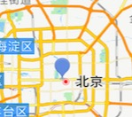
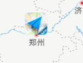
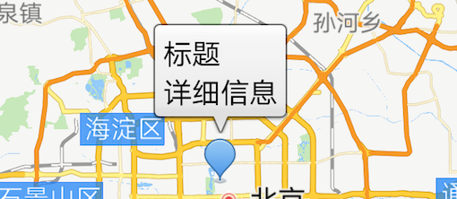
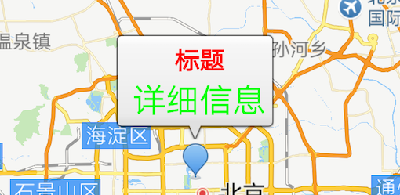

# 高德地图 - 绘制点标记

点标记用来在地图上标记任何位置，例如用户位置、车辆位置、店铺位置等一切带有位置属性的事物。

地图 SDK 提供的点标记功能包含两大部分，一部分是点（俗称 Marker）、另一部分是浮于点上方的信息窗体（俗称 InfoWindow）。同时，SDK 对 Marker 和 InfoWindow 封装了大量的触发事件，例如点击事件、长按事件、拖拽事件。

Marker 和 InfoWindow 有默认风格，同时也支持自定义。由于内容丰富，以下只能展示一些基础功能的使用，详细内容可分别参考官方参考手册。

[Marker](https://a.amap.com/lbs/static/unzip/Android_Map_Doc/3D/com/amap/api/maps/model/Marker.html)

[MarkerOptions](https://a.amap.com/lbs/static/unzip/Android_Map_Doc/3D/com/amap/api/maps/model/MarkerOptions.html)

[AMap.InfoWindowAdapter](https://a.amap.com/lbs/static/unzip/Android_Map_Doc/3D/com/amap/api/maps/AMap.InfoWindowAdapter.html)

## 绘制默认 Marker

绘制 Marker 的代码如下：

[Java](javascript:void(0);)

```
LatLng latLng = new LatLng(39.906901,116.397972);
final Marker marker = aMap.addMarker(new MarkerOptions().position(latLng).title("北京").snippet("DefaultMarker"));
```

以上代码绘制的 Marker 效果如下图：



**Marker 常用属性**

| 名称      | 说明                                 |
| :-------- | :----------------------------------- |
| position  | 在地图上标记位置的经纬度值。必填参数 |
| title     | 点标记的标题                         |
| snippet   | 点标记的内容                         |
| draggable | 点标记是否可拖拽                     |
| visible   | 点标记是否可见                       |
| anchor    | 点标记的锚点                         |
| alpha     | 点的透明度                           |

## 绘制自定义 Marker

可根据实际的业务需求，在地图指定的位置上添加自定义的 Marker。MarkerOptions 是设置 Marker 参数变量的类，自定义 Marker 时会经常用到。

下面以自定义 Marker 图标为例进行代码说明：

[Java](javascript:void(0);)

```
MarkerOptions markerOption = new MarkerOptions();
    markerOption.position(Constants.XIAN);
    markerOption.title("西安市").snippet("西安市：34.341568, 108.940174");

    markerOption.draggable(true);//设置Marker可拖动
    markerOption.icon(BitmapDescriptorFactory.fromBitmap(BitmapFactory
        .decodeResource(getResources(),R.drawable.location_marker)));
    // 将Marker设置为贴地显示，可以双指下拉地图查看效果
    markerOption.setFlat(true);//设置marker平贴地图效果
```

以上代码绘制的 Marker 效果如下图：



## 绘制动画效果 Marker

自地图 SDK V4.0.0 版本起，SDK 提供了给 Marker 设置动画的方法，具体实现方法如下：

[Java](javascript:void(0);)

```
Animation animation = new RotateAnimation(marker.getRotateAngle(),marker.getRotateAngle()+180,0,0,0);
long duration = 1000L;
animation.setDuration(duration);
animation.setInterpolator(new LinearInterpolator());

marker.setAnimation(animation);
marker.startAnimation();
```

## 可触发的 Marker 事件

**Marker 点击事件**

点击 Marker 时会回调AMap.OnMarkerClickListener，监听器的实现示例如下：

[Java](javascript:void(0);)

```
// 定义 Marker 点击事件监听
AMap.OnMarkerClickListener markerClickListener = new AMap.OnMarkerClickListener() {
    // marker 对象被点击时回调的接口
    // 返回 true 则表示接口已响应事件，否则返回false
    @Override
    public boolean onMarkerClick(Marker marker) {
        return false;
    }
};
// 绑定 Marker 被点击事件
mAMap.setOnMarkerClickListener(markerClickListener);
```

### **Marker 拖拽事件**

拖拽 Marker 时会回调AMap.OnMarkerDragListener，监听器的实现示例如下：

[Java](javascript:void(0);)

```
// 定义 Marker拖拽的监听
AMap.OnMarkerDragListener markerDragListener = new AMap.OnMarkerDragListener() {

    // 当marker开始被拖动时回调此方法, 这个marker的位置可以通过getPosition()方法返回。
    // 这个位置可能与拖动的之前的marker位置不一样。
    // marker 被拖动的marker对象。
    @Override
    public void onMarkerDragStart(Marker arg0) {
        // TODO Auto-generated method stub

    }

    // 在marker拖动完成后回调此方法, 这个marker的位置可以通过getPosition()方法返回。
    // 这个位置可能与拖动的之前的marker位置不一样。
    // marker 被拖动的marker对象。
    @Override
    public void onMarkerDragEnd(Marker arg0) {
    // TODO Auto-generated method stub

    }

    // 在marker拖动过程中回调此方法, 这个marker的位置可以通过getPosition()方法返回。
    // 这个位置可能与拖动的之前的marker位置不一样。
    // marker 被拖动的marker对象。
    @Override
    public void onMarkerDrag(Marker arg0) {
        // TODO Auto-generated method stub

    }
};
// 绑定marker拖拽事件
aMap.setOnMarkerDragListener(markerDragListener);
```

## 绘制 InfoWindow

InfoWindow 是点标记的一部分，默认的 Infowindow 只显示 Marker 对象的两个属性，一个是 title 和另一个 snippet，如果希望对InfoWindow 的样式或者内容有自定义需求，可以参考如下内容。

### 绘制默认 Infowindow

SDK 为用户提供了默认的 InfoWindow 样式，调用 Marker 类的 showInfoWindow() 和 hideInfoWindow() 方法可以控制显示和隐藏。当改变 Marker 的 title 和 snippet 属性时，再次调用 showInfoWindow()，可以更新 InfoWindow 显示内容。效果如下：



#### 绘制自定义 InfoWindow

#### **实现 InfoWindowAdapter**

InfoWindowAdapter是一个接口，其中有两个方法需要实现，依次来看一下:

[Java](javascript:void(0);)

```
public interface InfoWindowAdapter {
        View getInfoWindow(Marker marker);
        View getInfoContents(Marker marker);
}
```

**View getInfoWindow(Marker marker)**

当实现此方法并返回有效值时（返回值不为空，则视为有效）,SDK 将不会使用默认的样式，而采用此方法返回的样式（即 View）。默认会将Marker 的 title 和 snippet 显示到 InfoWindow 中。

如果此时修改了 Marker 的 title 或者 snippet 内容，再次调用类 Marker 的 showInfoWindow() 方法，InfoWindow 内容不会更新。自定义 InfoWindow 之后所有的内容更新都需要用户自己完成。当调用 Marker 类的 showInfoWindow() 方法时，SDK 会调用 getInfoWindow（Marker marker） 方法和 getInfoContents(Marker marker) 方法（之后会提到），在这些方法中更新 InfoWindow 的内容即可。

注意：如果此方法返回的 View 没有设置 InfoWindow 背景图，SDK 会默认添加一个背景图。

**View getInfoContents(Marker marker)**

此方法和 getInfoWindow（Marker marker） 方法的实质是一样的，唯一的区别是：此方法不能修改整个 InfoWindow 的背景和边框，无论自定义的样式是什么样，SDK 都会在最外层添加一个默认的边框。

### **实现 InfoWindow 样式和内容**

必须要先执行如下方法：

[Java](javascript:void(0);)

```
setInfoWindowAdapter(InfoWindowAdapter);//AMap类中
```

然后实现如下接口方法，自定义Infowindow的内容和样式：

[Java](javascript:void(0);)

```
/**
     * 监听自定义infowindow窗口的infocontents事件回调
     */
    public View getInfoContents(Marker marker) {
return null;
//示例没有采用该方法。
    }
    View infoWindow = null;

    /**
     * 监听自定义infowindow窗口的infowindow事件回调
     */
    public View getInfoWindow(Marker marker) {
if(infoWindow == null) {
    infoWindow = LayoutInflater.from(this).inflate(
            R.layout.custom_info_window, null);
}
render(marker, infoWindow);
return infoWindow;
//加载custom_info_window.xml布局文件作为InfoWindow的样式
//该布局可在官方Demo布局文件夹下找到
    }

    /**
     * 自定义infowinfow窗口
     */
    public void render(Marker marker, View view) {
//如果想修改自定义Infow中内容，请通过view找到它并修改
    }
```

自定义 InfoWindow 效果如下：



## 可触发的 InfoWindow 事件

**InfoWindow 点击事件**

点击 InfoWindow 时会回调 AMap.OnInfoWindowClickListener，监听器的实现示例如下：

[Java](javascript:void(0);)

```
OnInfoWindowClickListener listener = new OnInfoWindowClickListener() {
 
    @Override
    public void onInfoWindowClick(Marker arg0) {
        
        arg0.setTitle("infowindow clicked");
    }
};
//绑定信息窗点击事件
aMap.setOnInfoWindowClickListener(listener);
```